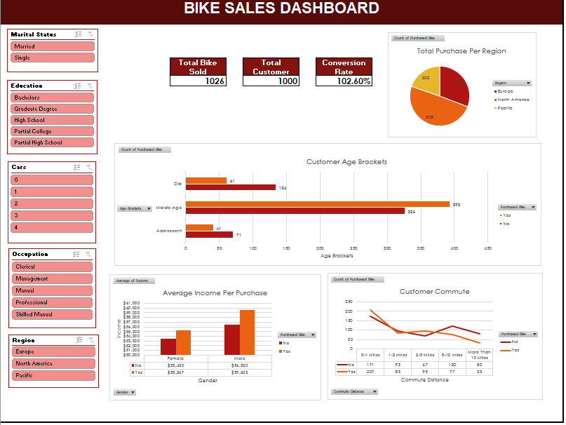

## 📊 Dashboard Objective
Dashboard berikut ini dibuat untuk menganalisis demografi pelanggan, perilaku perjalanan (_commuting_), serta tingkat pendapatan pelanggan untuk mengidentifikasi faktor-faktor utama yang mempengaruhi keputusan pembelian sepeda.  Dashboard ini dibuat secara interaktif, sehingga pengguna dapat menelusuri lebih lanjut mengenai _customer behaivor_ melalui _filtering data_ berdasar _Martial Status, Education Level, Occupation, Number of Cars,_ dan _Region_. 

### Dataset 
Data yang digunakan dalam dashboard ini dapat dilihat dan diunduh melalui sumber berikut ini : [bike_buyers_dataset](https://github.com/AlexTheAnalyst/Excel-Tutorial/blob/main/Excel%20Project%20Dataset.xlsx).

## Dashboard

  

## 🟩 Key KPIs :
1. Total Bike Sold
2. Total Customer 
3. Conversion Rate 
4. Total Purchase Per Region 
5. Customer Age Brackets
6. Customer Commute
7. Average Income Per Purcahse

## 🟨 Key Insights :
1. Middle Age Customer menunjukan tingkat kecenderungan membeli sepeda yang lebih tinggi dibandingkan dengan Adolescent dan Older Age Customer. 
2. Customer dengan jarak perjalanan (commute) yang lebih pendek (0–2 mil) menunjukkan kecenderungan yang lebih tinggi untuk membeli sepeda dibandingkan dengan pelanggan dengan jarak perjalanan yang lebih jauh
3. Customer dengan income yang lebih tinggi memiliki kemungkinan yang lebih besar untuk membeli sepeda. 
4. Tingkat pembelian sepeda pada customer laki-laki lebih tinggi dibandingkan customer perempuan, dan hal ini berkorelasi dengan rata-rata pendapatan pelanggan laki-laki yang lebih tinggi.
